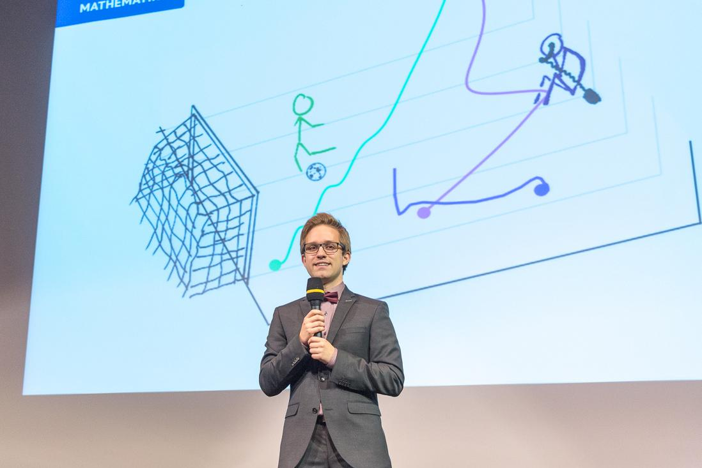

# {{ title }}

## Talks and slides

<!-- | 01/2023 | [PhD Defence]() | Vienna | -->

| | | |
|---|---|---|
| 09/2024 | [200 years old and still relevant: The Gauss-Seidel principle](/slides/2024/09-19-Lab-Summer-Conference/gauss_seidel_principle.html#/0/0/0){target="_blank"} | Lab Summer Conference 2024 (Kyoto) |
| 09/2024 | [Modelling heterogeneity of EMT to identify main drivers of basal extrusion](/slides/2024/10-03-ASHBi-KAIST/ashbi_kaist.html#/0/0/0){target="_blank"} | The 1st ASHBi-KAIST Joint Workshop (Kyoto) |
| 07/2024 | [Agent-based modelling of heterogeneous EMT scenarios](/slides/2024/07-24-ESMTB/esmtb_2024.html#/0/0/0){target="_blank"} | Annual Meeting ESMTB (Toledo) |
| 07/2024 | A live coding music performance with Julia ([Video](https://youtu.be/k-WUQFxWNj0?feature=shared){target="_blank"}) | JuliaCon 2024 (Eindhoven) |
| 07/2024 | [Tools for agent-based modelling in developmental biology](/slides/2024/07-12-JuliaCon/juliacon_abm.html#/0/0/0){target="_blank"} ([Video](https://youtu.be/V3bc3_d9TIM?feature=shared){target="_blank"}) | JuliaCon 2024 (Eindhoven) | 
| 03/2024 | [Position-based dynamics: Convergence theory andapplications to agent-based models](/slides/2024/03-22-Vienna/slides_vienna.html#/0/0/0){target="_blank"} | PDE seminar (Vienna) | 
| 03/2024 | [Towards kinetic theory for multi-scale muscle models](/slides/2024/03-08-Kinetic-theory-mucles/kinetic_theory.pdf){target="_blank"} | Inria (Paris) |
| 08/2023 | [Convergence of position based dynamics for first-order particle systems with volume exclusion](/slides/2023/08-22-ICIAM/iciam.html#/0/0/0){target="_blank"} | ICIAM 2023 (Tokyo) |
| 12/2022 | [Testing in scientific computing]({{ '/slides/Testing_in_scientific_programming.pdf' | url }}){target="_blank"} | Vienna |
| 12/2022 | [A short introduction to git]({{ '/slides/A_short_introduction_to_git.pdf' | url }}){target="_blank"} | Vienna |
| 11/2021 | [Position-based dynamics for ODEs with inequality constraints]({{ '/slides/pde_afternoon_2021_pbd.pdf' | url }}){target="_blank"} | PDE afternoon (Vienna) |
| 05/2020 | [Partially kinetic systems (aka 'particles on rails')](https://steffenpl.github.io/MyPaintEdSlidesExamples/talks/2020/partially_kinetic_systems/index.html){target="_blank"} | Kinetic Theory Coffee Break (online) |
| 06/2019 | [Short introduction to finite element exterior calculus]({{ '/slides/feec_short.pdf' | url }}){target="_blank"} | PhD seminar (Kaiserslautern) | 
| 03/2019 | [Partially mesoscopic and Lagrangian systems]({{ '/slides/descriptor_talk_march.pdf' | url }}){target="_blank"} | DESCRIPTOR (Paderborn) |
| 02/2019 | [Lagrangian perspective on skeletal muscle models]({{ '/slides/muscles_outlook.pdf' | url }}){target="_blank"} | GAMM, 90th Annual Meeting (Vienna) | 
| 10/2018 | [Fiber based muscle simulation (master's thesis)](https://steffenpl.github.io/MyPaintEdSlidesExamples/talks/2018/master_thesis_short/index.html){target="_blank"} | Hausdorff Center of Mathematics (Bonn) |
| 07/2018 | [Tangent spaces](https://steffenpl.github.io/MyPaintEdSlidesExamples/talks/2018/student_talk/index.html){target="_blank"} | Student-Talk (Kaiserslautern) |
| 06/2018 | [Simulation of skeletal muscle tissue with fiber-based dynamics](https://steffenpl.github.io/MyPaintEdSlidesExamples/talks/2018/master_thesis/index.html#/){target="_blank"} | Applied Math Seminar (Kaiserslautern) |
| 05/2018 | [Parameter identification in ODE models](https://steffenpl.github.io/MyPaintEdSlidesExamples/talks/2018/param_id_in_ode/index.html){target="_blank"} | The University of Auckland |
| 04/2018 | [Symplectic numerical integration](https://steffenpl.github.io/MyPaintEdSlidesExamples/talks/2018/symplectic_methods/index.html#/){target="_blank"} | PhD seminar (Auckland) |
| 09/2017 | [Symplectic molecular dynamics]({{ '/slides/molecular_dynamics.pdf' | url}}){target="_blank"} | 19th ÖMG Meeting and Annual DMV Meeting (Salzburg) |
| 01/2017 | Optimization of B-Spline Parametrizations using G+SMo and IPOPT | G+SMo Developer Days (TU Delft) |

## Organisation

_I organised (together with others) various events during my time as speaker of the [Vienna School of Mathematics (VSM)](https://vsmath.at) and earlier as member of the [student council at TU Kaiserslautern](https://www.mathematik.uni-kl.de/fachschaft-mathematik)._

| | | |
|---|---|---|
| 2023 | [Workshop: Development across Scale 2023](https://sites.google.com/kyoto-u.ac.jp/dev-across-scales-2023/home) (two days) |
| 2022 | [VSM Mini-Course on String Theory by Pavel Safronov](https://hackmd.io/@vsm/string-theory) (one week) |
| 2021 | [VSM workshop: A PhD in mathematics &ndash; career possibilities & gender aspects](https://ps-mathematik.univie.ac.at/e/index.php?event=VSM-WS2021) (one day)  |
| 2017 &ndash; 2019 | Student Talks (initiator of series of extracurricular talks at TU Kaiserslautern) |

## Software packages

*I am currently making various tools for **agent-based modelling** available as Julia packages.*

- [SpatialHashTables.jl](https://github.com/SteffenPL/SpatialHashTables.jl){target="_blank"}: A Julia package for spatial hashing of particles (in 2D and 3D). This allows fast collision detection even is unbounded domains.
- [BoundedDegreeGraphs.jl](https://github.com/SteffenPL/BoundedDegreeGraphs.jl){target="_blank"}: A Julia package for graphs with bounded degree, with focus on allocation free operations commonly 
used in agent-based modelling. 

## Outreach 

| | | |
|---|---|---|
| 22/5/2022 | Lange Nacht der Wissenschaft (long night of science) | Vienna |

---

Me during my talk about “studying mathematics at TU Kaiserslautern” on the graduation ceremony 2019.

