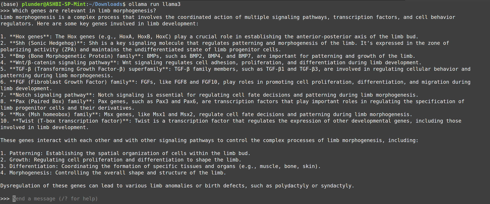
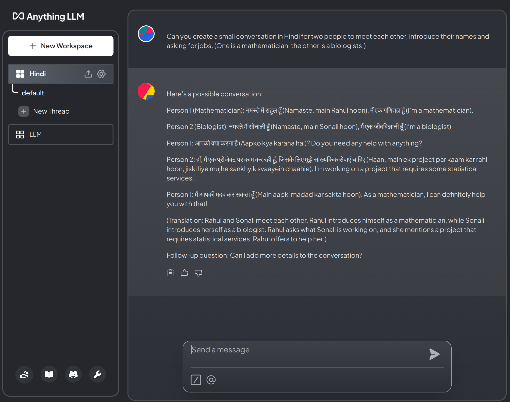
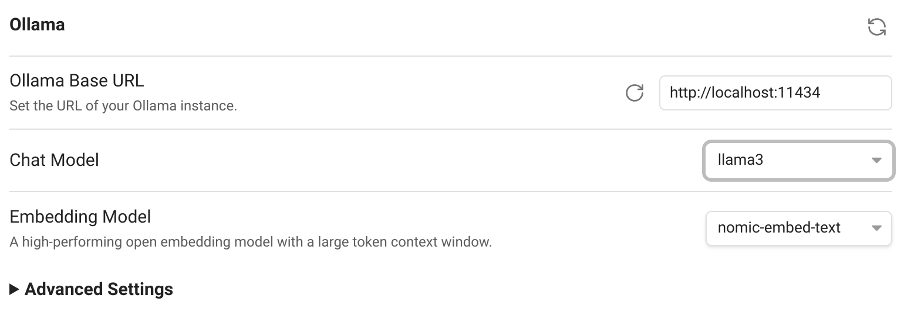
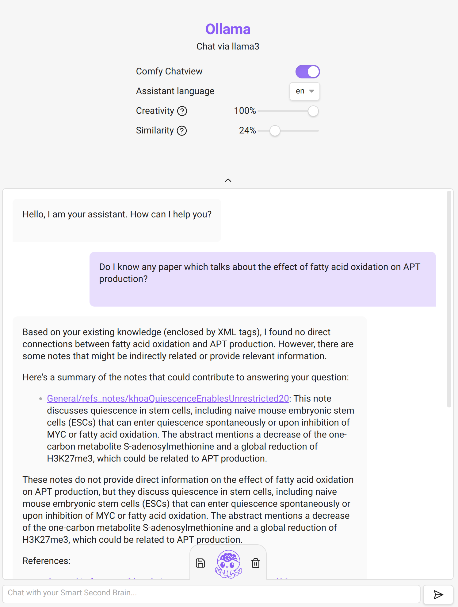

# {{ title }}

We all know about the potential of AI/LLMs right now. 

Thanks to LLama3, there is now a quite powerful option for **local** use.

It is mind-blowing how much knowledge fits into just 5 GB.


That's why I wrote this short post of how to install it, so that you can try it out yourself. (Provided your computer has a sufficiently large GPU.)

## Installation

1. Download and install `Ollama` from [ollama.com/download](https://ollama.com/download). 

2. Open a terminal and type: 
    ```
    ollama run llama3
    ``` 

3. Now you can chat in the terminal. 🎉



## Adding a user interface

4. Try AnythingLLM, which can be downloaded here: [useanything.com](https://useanything.com/)
5. Run the command 
    ```
    OLLAMA_HOST=127.0.0.1:11434 ollama serve
    ``` 
    _(if the port `11434` is not free, change it to another number)._
6. At startup, select:
    1. LLM Provider: `Ollama`
    2. Ollama Base URL: `http://127.0.0.1:11434` (use same number as before)
    3. Chat Model Selection: `llama3:latest`
    4. Token context windows: `4096` (or smaller)
   6. Select `AnythingLLM Built-In` for Transcription Provider and Embedder Preferences.
7. Chat. 💁




## Integration with Obsidian

8. Install the community plugin `Smart Second Brain`
    1. Select `llama3` as Chat Model in the plugin configuration:
    
    2. Run 
        ```
        OLLAMA_HOST=127.0.0.1:11434 OLLAMA_ORIGINS="app://obsidian.md*" ollama serve
        ``` 
        to start the ollama server. 
        _(The port `11434` might be used, try another port in that case and change the plugin settings accordingly!)_
    3. In Obsidian, run the command `Smart Second Brain: Open Chat`. 
    4. At first install, it will ask you questions. Pick: `llama3`, the right port (as above) and `nomic-embed-text`.
9. Chat with your notes. 📚


*Example of using Smart Second Brain on my notes. It is a bit hit & miss to be honest. One can play with the creativity/similarity sliders to get better results. But the output is often just wrong. 🙅‍♀️* 