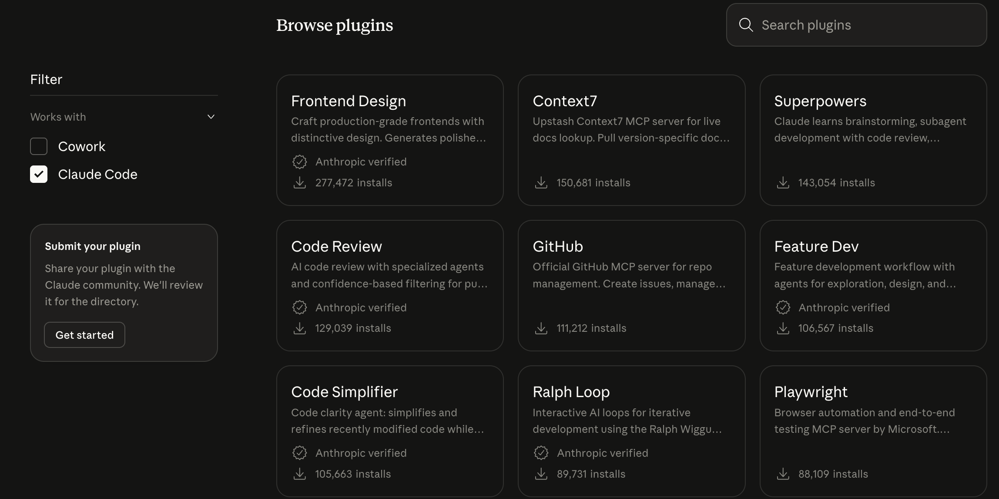
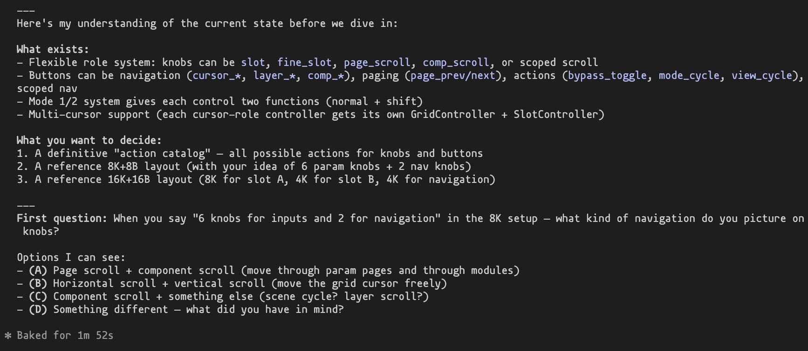
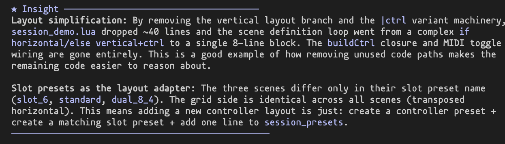

# {{ title }}

I use Claude Code a lot for coding and research tasks.
One of its strengths is that you can extend it with **Skills** and **MCPs** (Model Context Protocol servers).

Skills are modular instructions that Claude loads on-demand when relevant. MCPs are small servers/programs that give Claude access to external tools and data. Both are installed via the CLI.

I recommend scrolling through the curated list at [claude.com/plugins](https://claude.com/plugins#plugins) to find what is useful for you.



 Below are my personal recommendations.

## Superpowers

This is a skill pack that adds structured workflows for brainstorming, debugging, TDD, and code review. It sounds fancy but the practical effect is simple: Claude follows more disciplined processes instead of jumping straight into coding.

I find it especially useful for **brainstorming** before implementing a feature, and for the **debugging** workflow which forces Claude to actually investigate before proposing fixes.

```bash
claude install-skill https://claude.com/plugins/superpowers
```

Some of the `/commands` it adds:

- `/brainstorm` -- explore requirements and design before writing code
- `/debug` -- systematic root cause analysis instead of guessing
- `/tdd` -- test-driven development workflow
- `/review` -- code review with confidence-based filtering
- `/simplify` -- review changed code for reuse and quality

Here is an example of the brainstorming workflow:



## Context7

An MCP that pulls up-to-date library documentation directly into context. Instead of Claude hallucinating APIs from its training data, it fetches the current docs.

Very useful when working with libraries that update frequently.

```bash
claude mcp add context7 -- npx -y @upstash/context7-mcp@latest
```

## Explanatory Output Style

A lightweight skill that makes Claude add brief educational insights about your codebase as it works. It highlights implementation patterns and design choices specific to your project.

Good for learning a new codebase or when onboarding collaborators.

```bash
claude install-skill https://claude.com/plugins/explanatory-output-style
```

Here is an example of the output style in a rather technical project of mine:



## Where to find more

Browse the curated directory at [claude.com/plugins](https://claude.com/plugins#plugins) for more skills and MCPs. A few other popular ones worth checking out: **Frontend Design**, **Feature Dev**, and the **GitHub** MCP.

For background on how skills work (the three-level loading mechanism is quite elegant), see the [official docs](https://platform.claude.com/docs/en/agents-and-tools/agent-skills/overview).
