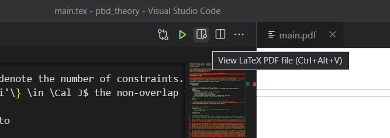
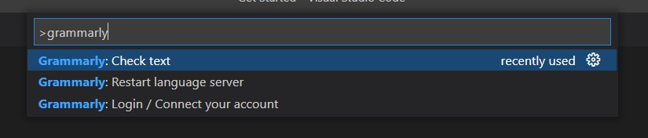

# {{ title }}

As a non-native English speaker, automatic spelling and grammar checks are helpful and allow me to focus more on what I write instead of how. For $\LaTeX$ documents, the choices of good grammar checkers are pretty limited. One problem is that our $\LaTeX$ documents have special commands and equations within sentences. This renders most grammar checkers useless since they would mark everything red. However, the currently developed [Grammarly for VS Code](https://marketplace.visualstudio.com/items?itemName=znck.grammarly) extension is an elegant and modern solution. While [Grammarly for VS Code](https://marketplace.visualstudio.com/items?itemName=znck.grammarly) is not perfect, it can handle HTML, Markdown, and $\LaTeX$ documents quite well. 

The example below shows how it suggests the right thing, even for a sentence with an inline equation:

_By the way, the Grammarly extension helped me avoid at least eight mistakes while writing this blog entry._ 😄

## How to use it?

[Visual Studio Code](https://code.visualstudio.com/) is a modern, cross-platform, open-source editor. While initially sceptical, I am now a happy user of VS Code for Julia, Python, C++, HTML/JavaScript and $\LaTeX$. 
The IntelliSense auto-completion makes VS Code a fully-fledged IDE[^1] for all those languages, and installing new extensions is very easy.   

If you want to start using VS Code for your $\LaTeX$, you just need to:
1. Install [Visual Studio Code](https://code.visualstudio.com/).
2. Go to the extensions tab (e.g. File > Preferences > Extensions).
3. Search for [LaTeX Workshop](https://marketplace.visualstudio.com/items?itemName=James-Yu.latex-workshop) and install it. 
    - On Windows, you might also have to install Perl, e.g. [Strawberry Perl](https://strawberryperl.com/).[^2]
    - To compile a $\LaTeX$ document, just open it and click on `Build LaTeX project` to compile, and use `View LaTeX PDF file` to see the final document.
    
    - Optionally: Check out the [LaTeX Workshop](https://marketplace.visualstudio.com/items?itemName=James-Yu.latex-workshop) page to learn more about the other cool features like auto-complete, live equation review and more.
4. Search for [Grammarly] and install it.
5. Press `Ctrl + Shift + P` and enter Grammarly. It should show you several options, in particular
    - `Grammarly: Login`: Use this to log into your account,
    - `Grammarly: Check text`: Spellcheck the current document.

That's it! 😎 I hope this quick tip helps you focus more on math. Feel free to write to me if the instructions are not detailed enough.

Of course, using a new editor is challenging, but to use VS Code, you just need to know exactly one thing:
Whenever you want to do something, press `Ctrl + Shift + P` to open the command palette; and then search for it.[^3]

[^1]: IDE = integrated development environment
[^2]: Perl is a programming language. The tool `mklatex` is written in Perl and used by the LaTeX Workshop to compile your $\LaTeX$ documents with all citations and references in one go.
[^3]: Of course, there is a lot to explore in VS Code, like good git integrations, how to automate your steps, handy short-cuts and more. But to start, all you need is `Ctrl + Shift + P` 😉.