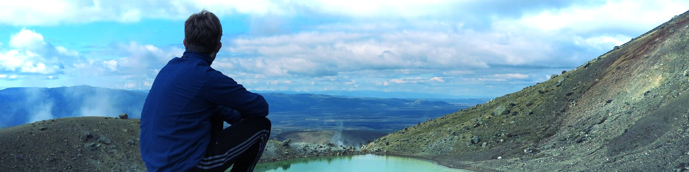

A detailed version of my CV can be found [here](/assets/cv.pdf).

# Short CV

## Education

| | |
|-------------------|----|
| 2013 &ndash; 2018 | **B.Sc. & M.Sc. in Mathematics at TU Kaiserslautern** |
| 2016 _(6 months)_ | ERASMUS at TU Delft |
| 2018 _(3 months)_ | Academic visit at The University of Auckland |
| 2018 &ndash; 2019 | Teaching assistant at TU Kaiserslautern |
| 2019 _(2 months)_ | Academic visit at Haussdorf Center of Mathematics Bonn |
| 2019 &ndash; now | **PhD candidate at University of Vienna** |

## Teaching experience

| | |
|-------------------|----|
| 2014 &ndash; 2016 | Tutor at TU Kaiserslautern (8 courses), including subjects like   Analysis for enginieers   Linear algebra and analysis I + II   Numerical methods for linear algebra and analysis |

## Skills

| | |
|-------------------|----|
| Programming | 10 years of experience. Advanced skills in C++, Julia, Python, Matlab. |

