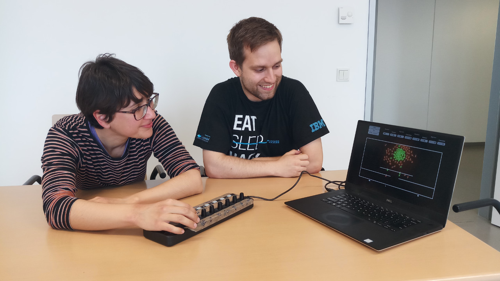

## Research interests

With my research, I want to answer **questions in biology using mathematical tools**. I have worked on mechanical models in developmental biology (epithelial-to-mesenchymal transitions), muscle dynamics, molecular dynamics and phage-bacterial interactions.

My mathematical toolset includes **mathematical modelling** with ordinary, stochastic and partial differential equations. An emphasis lies on **constrained systems** such as differential inclusions and differential-algebraic equations. My key experties is the implementation of efficient **numerical simulations** for such models and the development of **models in collaboration with biologists**.
<!-- 
My mathematical research interests are

**Biomathematics and modelling:** {.m-0}
- Mechanical models for cell dynamics; agent-based models
- Developmental biology (epithelial-to-mesenchymal transitions)
- Actin-myosin dynamics
- Elasticity theory

**Numerics:** {.m-0}
- Geometric numerical methods (symplectic methods, finite element exterior calculus)
- Coupled systems and inequality constraints (differential inclusions, position-based dynamics)

**Analysis:** {.m-0}
- Non-smooth dynamical systems (differential inclusions on uniformly prox-regular sets)
- Mean-field limits (in particular with constraints) -->

## Current projects

_The results shown in this section are work in progress._



## Completed projects



---

Sara Merino-Aceituno and me exploring an interactive simulation of our cell migration model for plithotaxis. This was part of an outreach activity that I developed for the “Long night of Science” in Vienna.

 
