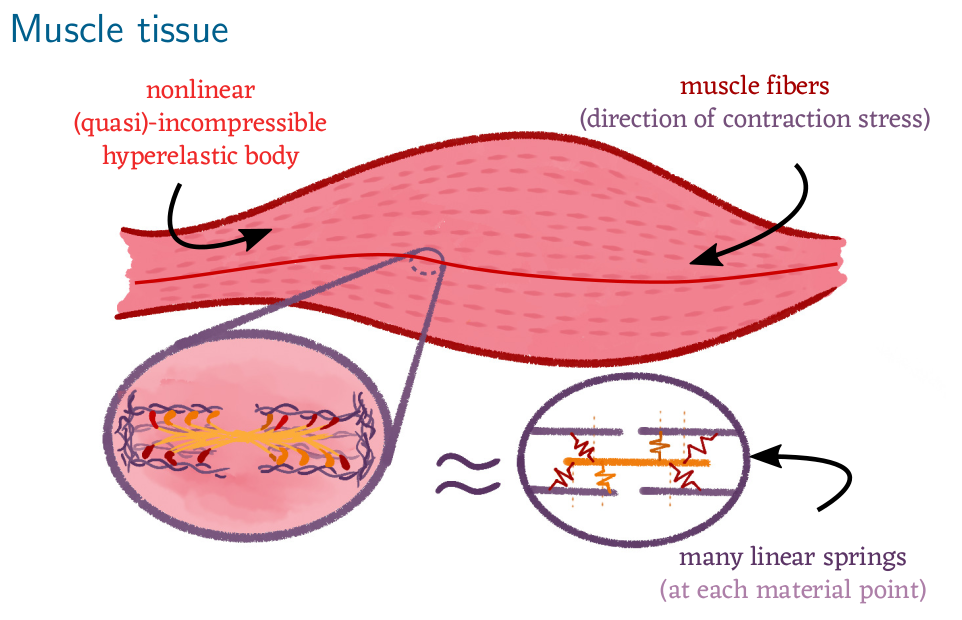
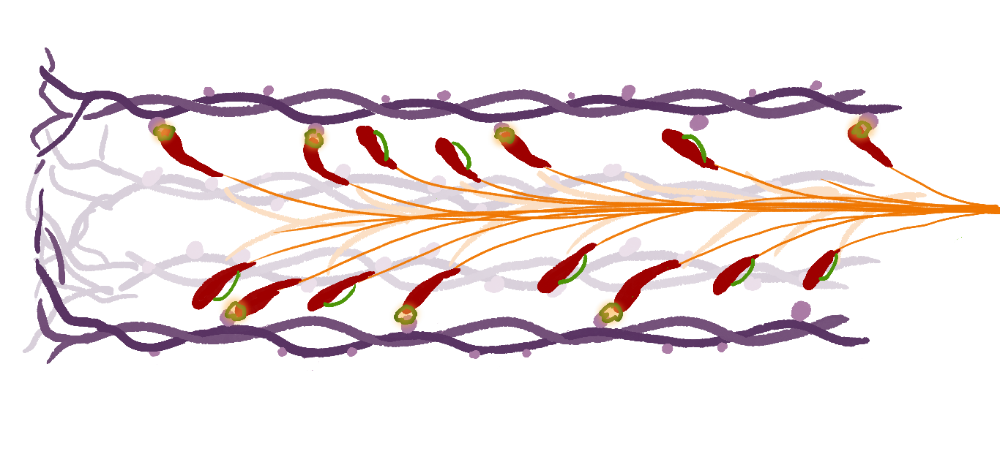

_**Very** short project description:_

# {{ title }}

*This project is a collaboration with [Bernd Simeon](https://www.mathematik.uni-kl.de/en/das/people/head/simeon){target="_blank"}.*

### Publications:

- **S. Plunder, [B. Simeon](https://www.mathematik.uni-kl.de/en/das/people/head/simeon){target="_blank"},** _The mean-field limit for particle systems with uniform full-rank constraints._ Kinetic and Related Models. **(2023)** [DOI:10.3934/krm.2023012](https://www.aimsciences.org/article/doi/10.3934/krm.2023012){target="_blank"}, [arxiv](https://arxiv.org/abs/2203.07249){target="_blank"}.
- **S. Plunder, [B. Simeon](https://www.mathematik.uni-kl.de/en/das/people/head/simeon){target="_blank"},** _Coupled Systems of Linear Differential-Algebraic and Kinetic Equations with Application to the Mathematical Modelling of Muscle Tissue._ **(2020)**
In: Reis, T., Grundel, S., Schöps, S. (eds) Progress in Differential-Algebraic Equations II. Differential-Algebraic Equations Forum. Springer, Cham. [DOI: 10.1007/978-3-030-53905-4_12](https://doi.org/10.1007/978-3-030-53905-4_12){target="_blank"}, [arxiv](https://arxiv.org/abs/1911.05468){target="_blank"}.

## Motivation from muscle dyanmics

Skeletal muscle tissue is one of the best understood systems in biology: Muscles contract at a macroscopic scale
because billions of small actin-myosin filaments contract on a molecular level. This theory is called the
[sliding filament theory](https://en.wikipedia.org/wiki/Sliding_filament_theory){target="_blank"} and it is the foundation for many precise 
muscle dynamics models.

Figure 1: Sketch of a skeletal muscle which consists of many muscle fibres. Each muscle fibre is a bundle of muscle cells (myocytes) 
which in turn contain actin-myosin filaments. The filaments are arranged in parallel such that their individual constration force accumulates.

Figure 2: Illustration of an myosin filament (purple) with a parallel actin filament (orange) and attached actin heads (red). The molecular properties of the actin-myosin heads leads to micrscopic spring like contraction.
 
## Mathematical abstraction

As so often, the mathematical theory to describe the microscopic dynamics is well understood, but it is less trivial to truthfuly related 
the microscopic dynamics to the macroscopic behaviour of the muscle tissue. The reason is that the mathematical theory one
typically would like to apply (kinetic theory) does not directly generalise in a complex system such as muscle tissues.  

In this project, we study a abstract model inspired by sliding filament theory. 
An example of this abstract simplification is shown in the following figure:

Figure 3: To simplify the mathematical analysis, we replace the muscle tissue 
with a finite dimensional physical system (heavy system) and the attached actin-heads are now a large-scale ODE
for particle-like dynamics. Crucially, both systems are coupled with each other, which constitutes a new class of systems
for which kinetic theory is not well-studied yet.
 
## Mean-field convergence for constrained particles

For a detailed exposition, we refer to our [publication](https://www.aimsciences.org/article/doi/10.3934/krm.2023012){target="_blank"}, [arxiv](https://arxiv.org/abs/2203.07249){target="_blank"}. Here, we show the main result in a illustrative setting.

The system in _Figure 3_ could be written as
$$
\begin{aligned}
m \ddot{X_i} &= F_1(X_i) + \nabla_{X_i} g(X_i, y) \lambda_i, \quad i=1,\dots,N,\\
\dot{y}      &= F_2(y) + \frac{1}{N} \sum_{j=1}^N \nabla_{y} g(X_j, y) \lambda,\\
g(X_i,y)     &= \mathrm{const.} \quad \forall i=1,\dots,N,
\end{aligned}
$$
where $F_1,F_2$ are forces, $N$ the number of particles and $g: \mathbb{R}^{n_x} \times \mathbb{R}^{n_y} \to \mathbb{R}^{n_x}$ are full-rank constraint functions
which might model that muscle contraction (macroscopic) corresponds to actin-myosin head contraction (microscopic).

A particular choice would be $F_1(X_i) = -\kappa_1 X_i$ and $F_2(y) = -\kappa_2 y$ and the constratin $g(X_i, y) = X_i - y$ (and $n_x = n_y$).

The term $\lambda_i$ is a Lagrangian multiplier which enforces the constraint $g(X_i,y) = 0$. In this particular setting,
the Lagrangian multipliers correspond to the forces which the particles exhibit onto the macroscopic system. Hence,
the term
$$
\frac{1}{N}\sum_{j=1}^N \nabla_{y} g(X_j, y) 
$$
is effectively a mean-field force.

The question arises if in the limit $N \to \infty$ one can replace this mean-field force with an integral. 
That is, if the discrete particle distribution ($X_1,\dots,X_N$) converges to a density $\rho(x,t)$ [^1]
then one would like to have
$$
\frac{1}{N}\sum_{j=1}^N \nabla_{y} g(X_j, y) 
\to \int_{\mathbb{R}^{n_x}} \nabla_{y} g(x, y) \rho(x,t) \mathrm{d}x 
\quad \text{as } N \to \infty.
$$

This is indeed the case and we proved this in our publication. Our result show that the mean-field limit is valid 
and the corresponding mean-field PDE is of the form
$$
\begin{aligned}
\partial \rho(x,t) &+ \mathrm{div}_x ( \rho(x,t) V(x,y,\dot{y}) ) = 0 \\ 
\tilde{M}(\rho, x) \ddot{y} &= \tilde{F}(\rho, y, \dot{y})
\end{aligned}
$$
where $\tilde{M}$ and $\tilde{F}$ are the mean-field mass and mean-field forces which 
depend on the current particle distrubution. The function $V(x,y,\dot{y})$ translates the macroscopic velocity $\dot{y}$ 
into the microscopic velocity of the particles (according to the constraint $g(X_i,y) = 0$).

Explicit formulas for these terms are provided in our article. 

In the example case of linear springs, $F_1(X_i) = -\kappa_1 X_i$ and $F_2(y) = -\kappa_2 y$ with constraint $g(X_i,y) = X_i - y$, 
the mean-field PDE is simply
$$
\begin{aligned}
\partial \rho(x,t) &+ \mathrm{div}_x ( \rho(x,t) \dot{y} ) = 0 \\ 
(1 + m) \ddot{y} &= \int -\kappa_1 x \rho(x,t) \, \mathrm{d} x - \kappa_2 y
\end{aligned}
$$
which has the interpretation that the macroscopic system is a heavy particle with mass $1+m$ and the forces of 
the cross-bridges do indeed accumulate into a nice integral. 

## Outlook

Our results are in particular interesting for nonlinear constratins. This can happend for example
when one consideres detailed molecular models for actin-myosin dynamics and effects such as 
shear-forces or rotation within muscles. The theory derived in this article can then 
provide a mathematically rooted framework to derive macroscopic models for muscle tissue.

However, there are critical limitations in our work. Most crucially, we only consider attached cross-bridges,
whereas in reality the cross-bridges detach after contraction. This is a very interesting direction for future research
as it requires additional theory to justify the mean-field limit in the presence of stochasticity.

---

[^1] Here, convergence is meant in the sense of weak convergence of probability measures, where we associate
the discrete distribution with the empirical measure $\rho_N(x,t) = \frac{1}{N} \sum_{i=1}^N \delta_{X_i(t)}(x)$.