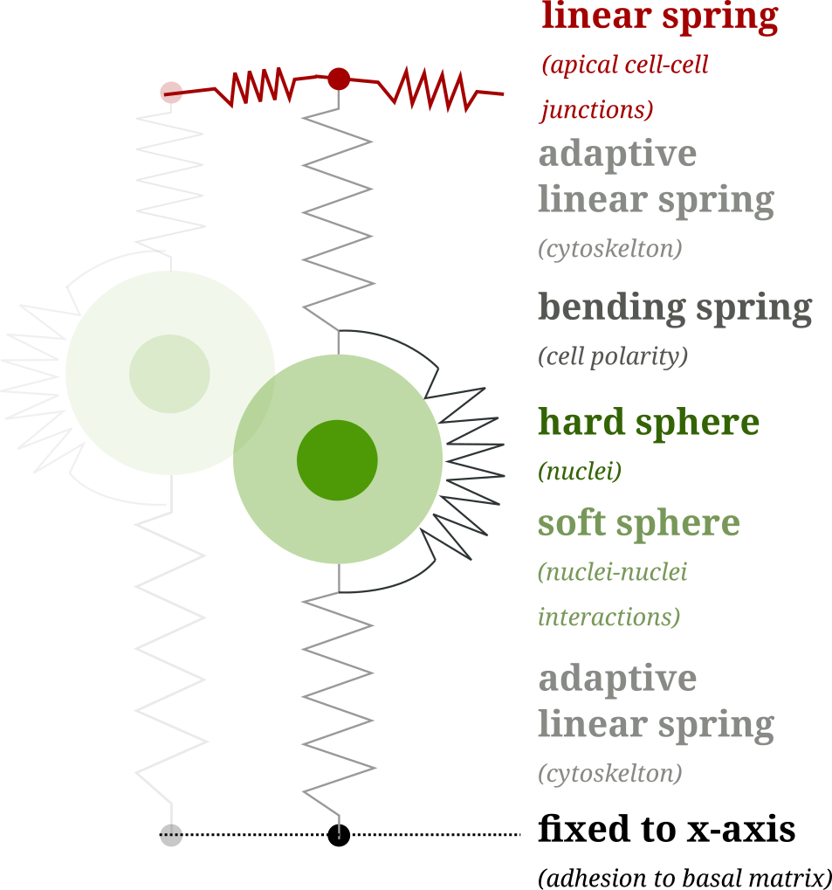

_Short project description:_
# {{ title }}

_This project is a collaboration with Eric Theveneau, Marina A. Ferreria, Diane Peurichard, Pierre Degond and Sara Merino-Aceituno._

The epithelial-to-mesenchymal transition (EMT) is a process during which epithelial cells[^1]
transition into mesenchymal cells. During this transition fundamental cell properties change.
For example, epithelial cells typical have adhesive bonds within each other. But as mesenchymal cells 
they might loss these adhesive bonds and become suddenly mobile. 

 
Image source: <a href="https://commons.wikimedia.org/w/index.php?curid=25952399">wikipedia.org</a>

## Project aims

The overall aim of our mathematical model is to understand 
the mechanical factors involved in epithelial-to-mesenchymal transition and the
resulting cell migration.
As there are many different directions to explore with _in vivo_ experiments, 
gaining additional insight into the cell dynamics would help in the design of experiments. Ideally, the model could indicate which directions are most promising.

Concretely, we want to come up with biological hypotheses which can be tested _in vivo_. 

A second goal is to use the computer model also to study scenarios that are difficult or almost impossible with current experimental tools. For example,
we can easily control the mixture of different cell types to model _heterogeneity_ in computer simulations. Doing the same experimentally is only possible to a limited degree. 
At the same time, it is observed that cells during EMT are very heterogeneous, which raises the question if this has an actual mechanical advantage or if the heterogeneity emerges for other reasons.

## The model

</img>

Without going into too many details, our model is a continuation of [Marina's model](https://journals.plos.org/ploscompbiol/article?id=10.1371/journal.pcbi.1007171) where we added extra rules to model EMT.

The core of the model is a "tennis ball in a sock" description of the cells: Since the cell membrane is stretched out (like a sock) 
and the nucleus is the hardest part of the cell (like the tennis ball) we consider the nucleus as a _sphere-like object_ and the membrane and the other cell structure as _linear springs_.

Without further ado. This is how a simulation of pseudo-stratified tissue _without_ EMT looks like (according to our model):

<video class="max-w-full" controls autoplay loop>
<source src="{{ '/assets/videos/no_emt.mp4' | url }}" type="video/mp4">
</video>

## Mathematical aspects

The main mathematical change was to use a first-order differential equation instead of a quasi-steady state simulation. This transition allows us to use of different numerical methods. And it turned out 
that [position-based dynamics]({{ '/research/projects/position-based-dynamics' | url }}) was with quite some margin the fastest method for our model.

The model is (roughly) of the form
$$
\dot z = f(z,t) + \sum_{k} \lambda_k \nabla_z g_k(z, t)
$$
with the conditions
$$
g_k(z) \geq 0, \quad \lambda_k \geq 0 \quad \text{and} \quad g_k(z) \lambda_k = 0.
$$

The degrees of freedom are the positions of the nuclei and the upper- and lower-endpoints of the cell membrane (which we call apical- and basal-points).

In addition to the differential equation, there are many additional rules which change certain properties of the model at discrete times. For example:
- Cell division,
- Growth of the cell prior to division,
- Typical for pseudo-stratified tissue: The cytoskeleton pulls the nucleus towards the apical layer, just before the division starts.

### The EMT model

To model EMT we added the following events
- **A: Loss of apical adhesion** (removal of apical-nuclei spring),
- **B: Loss of basal adhesion** (removal of basal-nuclei spring),
- **S: Degeneration of cell straightness** (reduction of the bending spring),
- **p: Protrusions** (cells start moving in direction of their polarity).

In a simplified world, cells would perform $A \to B \to S \to p$ in a regular manner. But in reality, it is sometimes a complete mess.
Cells might only do some of these steps, or have completely different timings.

## Results

A full display of all aspects of the model is beyond the scope of this brief project description.[^st] To show a one aspect, I will present one simulation of cells that lose their apical adhesion (after 12h) and are then passively pushed towards the basal side. 

[^st]: In total we simulated over 2000 different setups, using statistical methods for ranking and evaluation of the results. 

<video class="max-w-full" controls autoplay loop>
<source src="{{ '/assets/videos/sim_a6_b24_concave.mp4' | url }}" type="video/mp4">
</video>

In the video, the white cells are from the control population without EMT and the red cells perform EMT. 

Some observations which can be made in the model:
- The loss of adhesion removes the EMT cells from the center of the tissue.
- After EMT, most of the cells are positioned on the basal side of the tissue (black line), from where they could further migrate through the basal matrix.
- Some EMT cells extrude towards the apical side (red line) of the tissue. This can be avoided by adding protrusive activity during EMT. 

## Numerical aspects

The numerical simulation of differential equations with inequality constraints 
is an old but very diverse topic. The preferred numerical methods vary fundamentally depending on the application, ranging from discrete element methods for engineering applications to complex algorithms from non-smooth mechanics or elasticity.

Our method of choice is the rather novel [position-based dynamics (PBD)](../position-based-dynamics).
The advantage of PBD is that it has nearly optimal speed and it does not waste unnecessary resources on satisfying the inequality constraints. This allowed us to run millions of simulations within a few hours. This uncompromising approach allowed us to generate enough data for statistical data analysis. Moreover, the numerical stability of PBD resolved issues previous algorithms had when the tissue is very packed. 

## To be continued...

This description is about ongoing research, as such, it is subject to change
and non of the results is final. 

[^1]: For non-biologists: An example of epithelial tissue is your skin.

